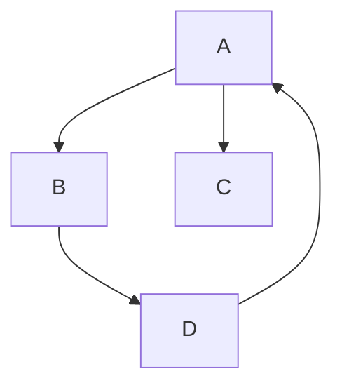
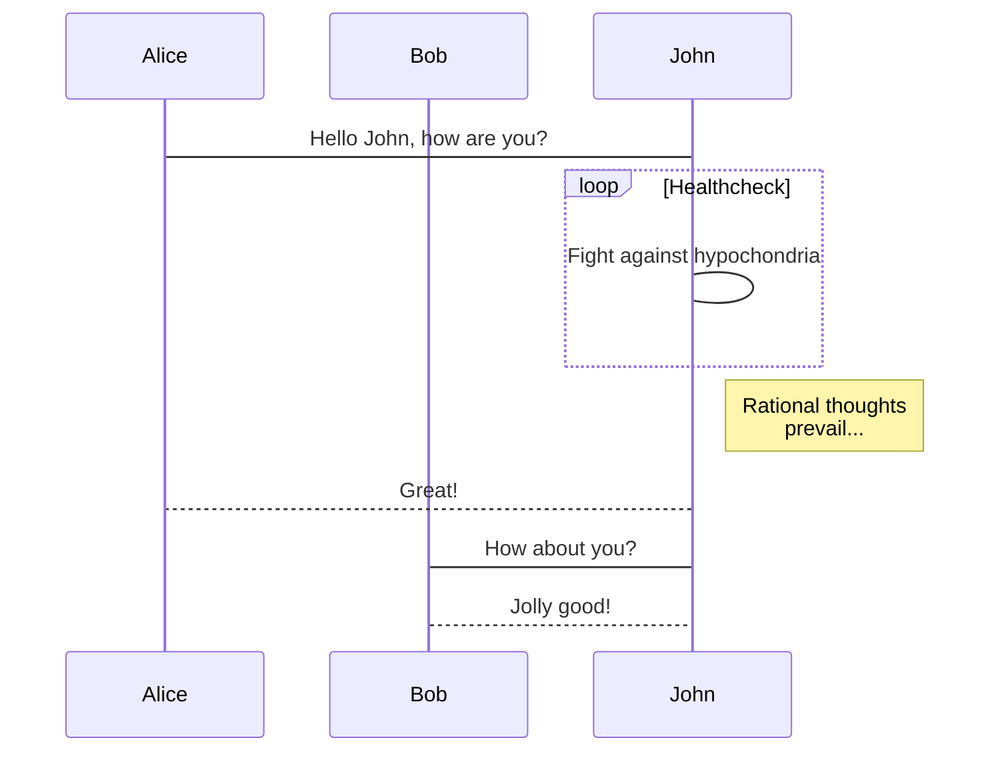
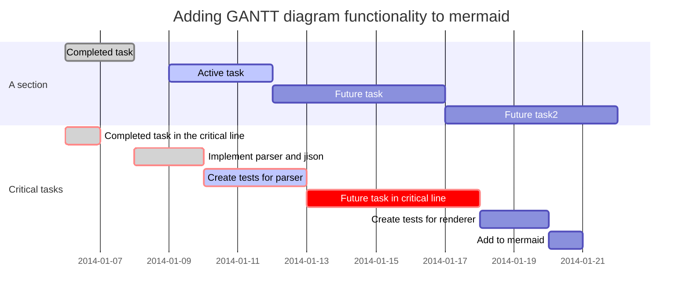
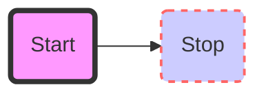
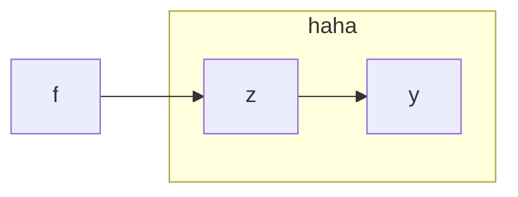

一篇测试用的文章，用来测试每次升级hexo或者添加插件之后各项渲染是否正常
包括MathJax，Mermaid等等
<!--more-->

------

# 文章渲染标题测试

# Heading 1

## Heading 2

### Heading 3

#### Heading 4

##### Heading 5

###### Heading 6

# 正文部分Markdown渲染测试

文章正文，字体渲染测试

滚滚长江东逝水，浪花淘尽英雄。是非成败转头空，青山依旧在，几度夕阳红。白发渔樵江渚上，惯看秋月春风。一壶浊酒喜相逢，古今多少事， 都付笑谈中。滚滚长江东逝水，浪花淘尽英雄。是非成败转头空，青山依旧在，几度夕阳红。白发渔樵江渚上，惯看秋月春风。一壶浊酒喜相逢，古今多少事， 都付笑谈中。滚滚长江东逝水，浪花淘尽英雄。是非成败转头空，青山依旧在，几度夕阳红。白发渔樵江渚上，惯看秋月春风。一壶浊酒喜相逢，古今多少事， 都付笑谈中。

English text rendering test 

"Lorem ipsum dolor sit amet, consectetur adipiscing elit, sed do eiusmod tempor incididunt ut labore et dolore magna aliqua. Ut enim ad minim veniam, quis nostrud exercitation ullamco laboris nisi ut aliquip ex ea commodo consequat. Duis aute irure dolor in reprehenderit in voluptate velit esse cillum dolore eu fugiat nulla pariatur. Excepteur sint occaecat cupidatat non proident, sunt in culpa qui officia deserunt mollit anim id est laborum."

换行测试, 跟下一句中间没有空行.
空行会生成一个新的 `<p>` , 没有空行的中间是个 `<br>`

一段文字中可以有 **加重** 的文字或者 *倾斜* 的文字或者 ***又重又斜***

>这里是一个引用

>这里是另一个引用
>
>但是中间空了一行
>>还可以套娃

---

- 上面应该有一条横线
- 然后这是个无序列表
- 可以缩进
  - 像这样

1. 这是一个有序列表
2. 有序列表是有顺序的
   就是会有123456的列表
3. 列表还可以嵌套
    1. 写出子项
        1. 或者孙子
        
        然后里面可以也可以有说明文字，并且如果是很长很长很长很长很长很长很长很长很长很长很长很长很长很长很长很长很长很长很长，会自己缩进换行到合适的位置

| 画一个桌子     | This is a Table | 表格|
| :-----------  | :-----------: | ---:|
| 上面一行是      | 表头       | 颜色不一样|
| 左对齐        | 剧中        |右对齐|

# MathJax渲染测试

行内（inline）写法，使用 ``$...$`` 框上要写的公式， 
例如这样 $e^{i\pi}+1=0$ 公式就渲染在同一行文字内

或者使用 `&&...&&` 框上公式，渲染到下一行并剧中显示
比如这样：
$$\left \lbrace \sum_{i=0}^n i^3 = \frac{(n^2+n)(n+6)}{9} \right \rbrace$$

# 代码高亮测试

```c
/**
 * This is comment
 */
int main() {
    printf('Hello World\n');
    return 0;
}
```

```javascript
// this is javascript and comment
var add = function(x, y) {
  return x + y;
};
var x = 12;
var y = 13;
```

```java
// Java Comment
/**  This is Java Comment **/
public class Test {
  public static void main(String[] args) {
    System.out.println("Hello World");
  }
}
```
# Mermaid 画图











